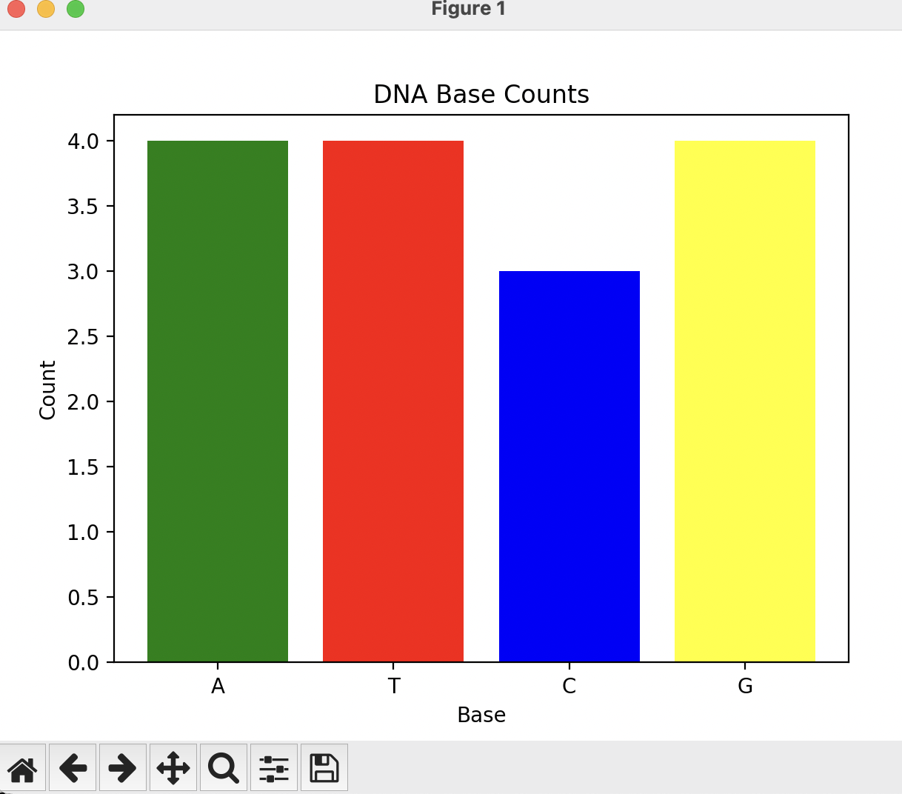

# DNA Base Count & Visualization

## Overview
This project counts the bases (A, T, C, G) in a sample DNA sequence and visualizes the counts using a bar chart with Python.
## Skills Demonstrated
- Python programming basics
- String manipulation and counting
- Data visualization with matplotlib
## How to Run
1. Make sure Python 3 and matplotlib are installed.
2. Run the base counting script:
3. Run the visualization script:
python3 dna_counter.py

markdown
Copy

## Example Output

Here is a bar graph showing the count of each DNA base (A, T, C, G) in the sample sequence:

- The `dna_counter.py` script prints the counts of each DNA base.
- The `dna_visualize.py` script displays a bar chart showing base counts.

## Next Steps / Improvements
- Modify the scripts to read DNA sequences from external files.
- Analyze longer DNA sequences or real genomic data.
- Add more advanced visualizations or statistical analysis.
# DNA Base Count & Visualization

## Overview
This project counts the bases (A, T, C, G) in a sample DNA sequence and visualizes the counts using a bar chart with Python.

## Skills Demonstrated
- Python programming basics
- String manipulation and counting
- Data visualization with matplotlib

## How to Run
1. Make sure Python 3 and matplotlib are installed.
2. Run the base counting script:    python3 dna_counter.py
# DNA Base Count & Visualization

## Overview
This project counts the bases (A, T, C, G) in a sample DNA sequence and visualizes the counts using a bar chart with Python.

## Skills Demonstrated
- Python programming basics
- String manipulation and counting
- Data visualization with matplotlib

## How to Run

1. Make sure Python 3 and matplotlib are installed.
2. Run the base counting script:

    python3 dna_counter.py

3. Run the visualization script:

    python3 dna_visualize.py
